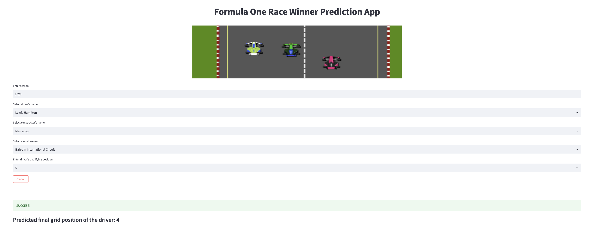
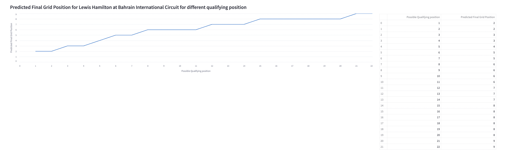

# Formula One Race Data Analysis and Driver Rank Prediction

## Basic Idea of Formula One?

Formula One, often referred to as F1, represents the pinnacle of international open-wheel single-seater formula racing, overseen by the Fédération Internationale de l'Automobile (FIA). Since its inaugural season in 1950, the FIA Formula One World Championship has held a preeminent position within the global racing landscape. The term "formula" within its nomenclature pertains to the comprehensive regulations that govern the design and performance parameters of all participating cars. Each Formula One season encompasses a series of races known as Grands Prix, which transpire across diverse countries and continents, occurring on bespoke circuits or temporarily closed public roads.

Having originated in 1950, Formula One racing boasts a distinguished heritage as one of the most enduring motorsport events. Its widespread popularity positions it among the foremost sports worldwide. The sport's activities yield an extensive corpus of data, meticulously gathered through sensors integrated within the vehicles during practice, qualifying, and the ultimate race sessions.

## Purpose of the Project


The utilization of big data analytics affords Formula 1 teams a distinct competitive advantage by facilitating prompt and effective data-driven decision-making processes, ultimately culminating in enhanced race outcomes.

Our research endeavors to undertake a comprehensive analysis of historical data with the objective of discerning the performance of drivers, employing an array of statistical metrics. These metrics encompass diverse facets such as the frequency of pit stops, race completion times, point accrual, attainment of podium positions, and other pertinent variables. This meticulous examination will not only furnish valuable insights into driver performance but also lay the foundation for prognosticating forthcoming race results based on antecedent performances.

## Project Overview

This project tries to comprehend the data from previous Formula 1 races and forecast the race outcome based on user inputs using Machine Learning Algorithms. For data exploration and model construction, check out the jupyter notebooks.

## Installation

The project runs on [Python 3.10](https://www.python.org/downloads/release/python-3100/) and all requirements can be installed by the following command [pip](https://pip.pypa.io/en/stable/) package manager and requirement.txt


```bash
pip install -r requirements.txt
```

## Usage
After installation of all the required libraries, open your terminal, navigate to the folder containing the app.py file and run the below command.

```python
streamlit run app.py

```
The Streamlit web application will open in a new browser window hosted at your localhost. There will be an input form where the user can enter the season, driver name, constructor name, and circuit name in the respective dropdowns.

| Field Name | Description |
| --- | --- |
| Season | Enter the year for which you want to make the prediction |
| Driver's name | Select the driver's name for whom you want to make the prediction |
| Constructor's name | Select the constructor's name for whom the selected driver is driving |
| Circuit's name | Select the name of the circuit where the race is going to happen |



Click the predict button for the results.


